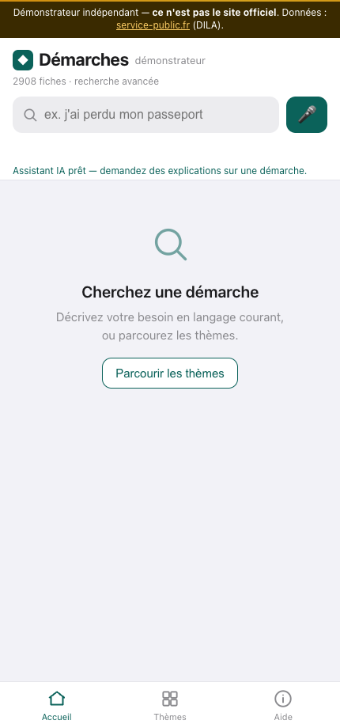
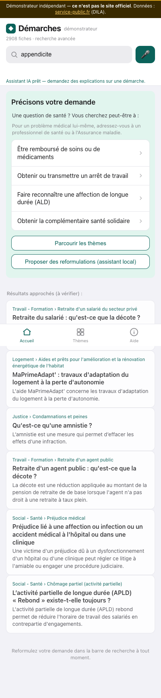
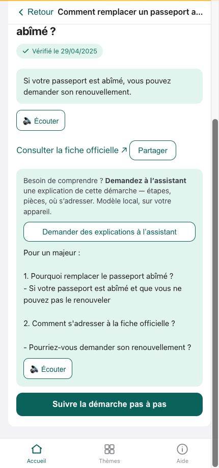
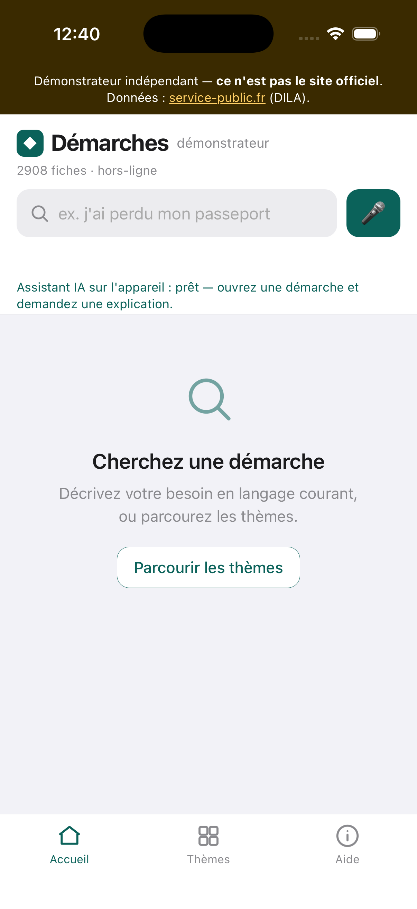

### Nom du défi
Agent administratif — trouver, comprendre et préparer ses démarches, 100 % hors-ligne et privé

### Description courte
Un assistant qui aide chaque citoyen à trouver, comprendre et préparer ses démarches administratives à partir des fiches « Vos droits » de service-public.fr (DILA) — entièrement sur l'appareil, hors-ligne, sans collecte de données. Démonstrateur indépendant (non officiel).

### Porteur
Alain Crawford <!-- à confirmer : nom de l'équipe ou du porteur -->

### Description longue
**Le contexte.** Réaliser une démarche administrative reste un parcours du combattant : des milliers de fiches, un vocabulaire d'expert, des cas particuliers imbriqués. Les personnes âgées, peu à l'aise avec l'écrit, en situation de handicap ou non-francophones sont les premières exclues. Ces démarches touchent en plus à l'intime (santé, famille, argent), et l'aide doit rester utilisable même sans connexion fiable.

**L'objectif.** Un assistant qui comprend une demande formulée en langage courant, guide pas à pas, explique et lit à voix haute — et qui **n'agit jamais à la place de la personne**, tout en gardant les données sur l'appareil.

**La proposition.** Une application (web PWA + apps natives iOS/Android) qui, à partir du corpus officiel, permet de **chercher**, **comprendre** et **préparer** une démarche, entièrement en local :

- **Recherche hybride** — BM25 (lexical) + sémantique (embeddings e5 multilingues) fusionnés par RRF : comprend « je vais avoir un bébé » comme « j'ai perdu mon passeport ».
- **Reformulation active + validation** — quand la demande est floue ou hors-domaine (« appendicite »), l'app ne devine pas : elle propose des démarches précises à valider (« être remboursé de soins ? arrêt de travail ? ») et conjugue ces pistes avec les résultats.
- **Déroulé pas à pas** — les fiches deviennent des parcours guidés : questions sur la situation, pièces à fournir filtrées selon le cas, téléservice officiel à ouvrir soi-même.
- **Garde-fou humain** — l'application n'effectue aucune démarche à votre place ; toute ouverture de téléservice demande une confirmation explicite.
- **Voix** — dictée locale (Whisper) et lecture à voix haute (synthèse vocale du système), pour l'accessibilité.
- **Où s'adresser** — recherche du guichet réel (mairie, France Services…) via l'API Annuaire de l'administration.
- **Explications par assistant local** — un petit LLM (WebGPU, dans le navigateur) explique une démarche en s'appuyant uniquement sur la fiche, sans rien inventer.

**Le déroulé technique.** Le jeu « Vos droits » de la DILA (schéma 3.5) est transformé en index de recherche et en parcours structurés (arbres de cas/étapes, pièces, téléservices, guichets) couvrant **2 908 fiches** sur **11 thèmes**. Toute la chaîne s'exécute côté client : BM25 en JavaScript pur, embeddings *multilingual-e5-small* via Transformers.js (WASM, quantifié q8), assistant *Qwen2.5-0.5B* via WebLLM/WebGPU, dictée *Whisper*. Une garde de confiance à deux seuils (voisin sémantique + ancrage lexical) évite de répondre faux. L'empaquetage en apps natives (Capacitor) embarque corpus et modèles pour un **hors-ligne réellement garanti**. Confidentialité par conception : CSP stricte, exécution 100 % locale, étiquette « aucune donnée collectée ».

**Principes.** Vos données ne sortent pas de l'appareil. L'app vous outille, vous décidez. Non officiel et transparent : aucun insigne d'État, lien visible vers la source officielle.

### Image principale

### Contributeurs
- Alain Crawford <!-- compléter la liste des contributeurs -->

### Ressources utilisées
Cochez les ressources utilisées en remplaçant `[ ]` par `[x]`.

- [ ] `openfisca-france-parameters` — Base de données de paramètres ✺ OpenFisca
- [ ] `an-dossiers-legislatifs` — Dossiers législatifs de l'Assemblée nationale (législature courante) ✺ Assemblée nationale
- [ ] `an-amendements-xvii` — Amendements déposés à l'Assemblée nationale (législature actuelle) ✺ Assemblée nationale
- [ ] `an-comptes-rendus` — Comptes rendus de la séance publique à l'Assemblée nationale (législature actuelle) ✺ Assemblée nationale
- [ ] `an-votes-xvii` — Votes des députés (législature actuelle) ✺ Assemblée nationale
- [ ] `an-deputes-en-exercice` — Députés en exercice ✺ Assemblée nationale
- [ ] `an-deputes-historique` — Historique des députés ✺ Assemblée nationale
- [ ] `an-deputes-senateurs-ministres-par-legislature` — Députés, sénateurs et ministres d'une législature ✺ Assemblée nationale
- [ ] `an-agenda-reunions` — Agenda des réunions à l'Assemblée nationale (législature courante) ✺ Assemblée nationale
- [ ] `an-questions-gouvernement` — Questions de l'Assemblée nationale au Gouvernement ✺ Assemblée nationale
- [ ] `an-questions-gouvernement-ecrites` — Questions écrites de l'Assemblée nationale au Gouvernement ✺ Assemblée nationale
- [ ] `an-questions-gouvernement-orales` — Questions orales de l'Assemblée nationale au Gouvernement ✺ Assemblée nationale
- [ ] `premier-ministre-legi` — Codes, lois et règlements consolidés ✺ Premier ministre
- [ ] `premier-ministre-dole` — Dossiers législatifs Légifrance ✺ Premier ministre
- [ ] `premier-ministre-jorf` — Édition ''Lois et décrets'' du Journal officiel ✺ Premier ministre
- [ ] `senat-dispositifs-textes` — Dispositifs des textes déposés ou adoptés au Sénat ✺ Sénat
- [ ] `senat-dossiers-legislatifs` — Dossiers législatifs du Sénat ✺ Sénat
- [ ] `senat-amendements` — Amendements déposés au Sénat ✺ Sénat
- [ ] `senat-senateurs` — Sénateurs ✺ Sénat
- [ ] `senat-questions-gouvernement` — Questions orales et écrites du Sénat au Gouvernement ✺ Sénat
- [ ] `senat-comptes-rendus` — Comptes rendus de la séance publique au Sénat ✺ Sénat
- [ ] `an-et-co-database-regroupement-toutes-donnees` — Base de données unifiée Parlement / Législation / Service Public ✺ Assemblée nationale & communauté
- [ ] `an-et-co-serveur-mcp-regroupement-toutes-donnees` — Serveur MCP  - Accès unifié Parlement / Législation / Service Public ✺ Assemblée nationale & communauté
- [ ] `an-et-co-api-regroupement-toutes-donnees` — API - Accès unifié Parlement / Législation / Service Public ✺ Assemblée nationale & communauté
- [ ] `legiwatch-api-parlement` — API Parlement ✺ LegiWatch
- [ ] `legiwatch-database-parlement` — Base de données Parlement ✺ LegiWatch
- [ ] `legiwatch-serveur-mcp-parlement` — Serveur MCP Parlement ✺ LegiWatch

<!-- Note : ce projet s'appuie sur les fiches « Vos droits » de service-public.fr (DILA, Licence Ouverte 2.0). Si vous avez utilisé la base/API/MCP unifiée « Service Public », cochez la ou les entrées `an-et-co-…-regroupement-toutes-donnees` correspondantes. -->

### Galerie
- 
- 
- 
- 
- 
- 

### Documents
- [Diapositives de présentation (PDF)](docs/diapositives.pdf)
- [Tableur 1](hackathon-an-2026/docs/Classeur1.xlsx)
- [Document 2](hackathon-an-2026/docs/document-2.pdf)

### URL de démonstration
https://alcrawfo-agent-administratif.static.hf.space

<!-- Page du Space (fiche, README) : https://huggingface.co/spaces/alcrawfo/agent-administratif -->
<!-- L'assistant IA nécessite WebGPU (Chrome/Edge récents) ; recherche, dictée et déroulé des démarches fonctionnent sans. L'app fonctionne aussi 100 % en local. -->

### Diapositives de présentation
[Diapositives de présentation](docs/diapositives.pdf)
